# CMSC 124 Project
**B-4L** - Group EZR 
Rio John Jr. Ducusin 
Zyril Tamargo 
Johanna Eikou Teknomo

# App Guide
## Getting Started
In order to start the program, you will need Visual Studio Code and Python 3.

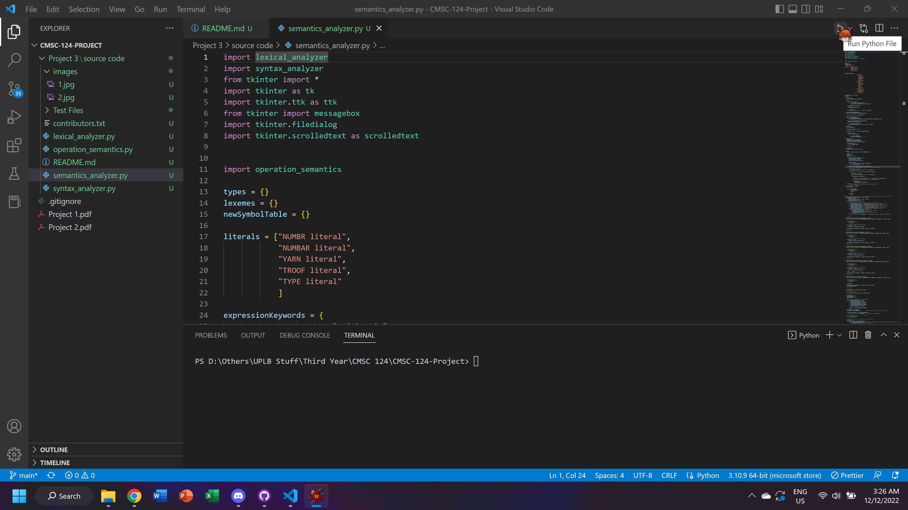

Once you run the `semantics_analyzer.py` file, you will then see the following GUI pop up.

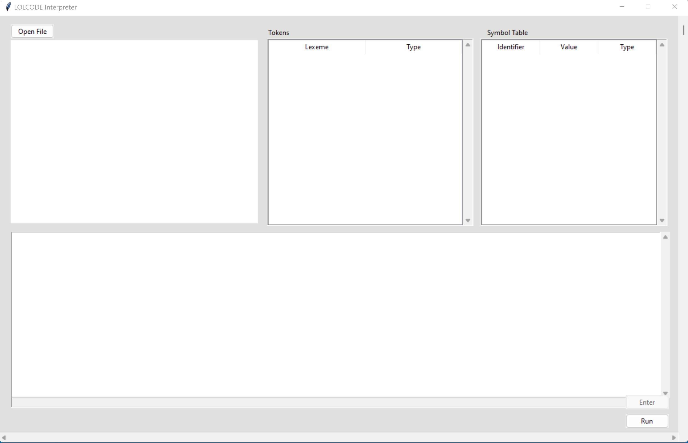

## Text Editor
The program consists of four parts. You may open a file or type LOLCODE into the text editor on the upper left. Clicking the `Open File` button will open your directory in which you are able to choose a LOLCODE file to read.

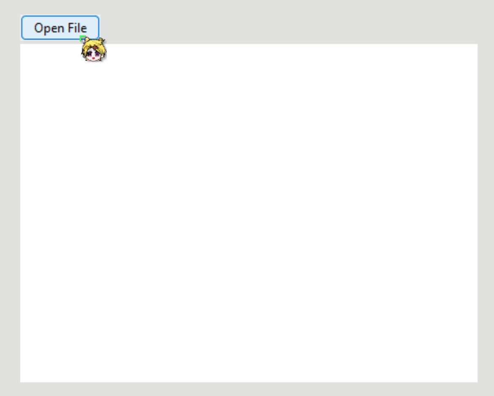
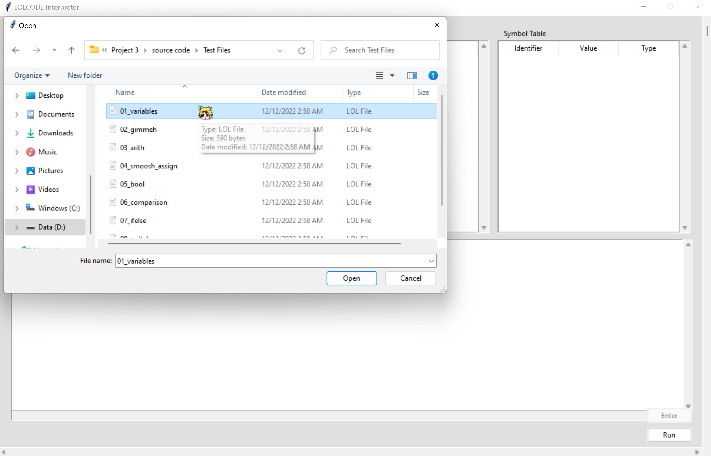

Then, opening the file will place its contents into the text editor. This is the code which will then be interpreted in the program.

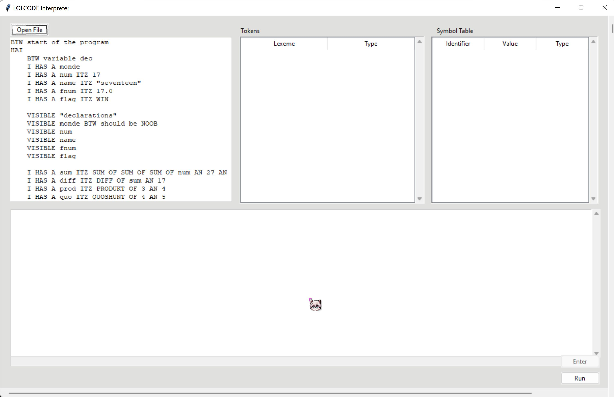

The text editor can also be typed into and the newly written code will be interpreted by the program. The code can be scrolled through horizontally and vertically using the scrollbars on the rightmost side and bottom side of the screen.

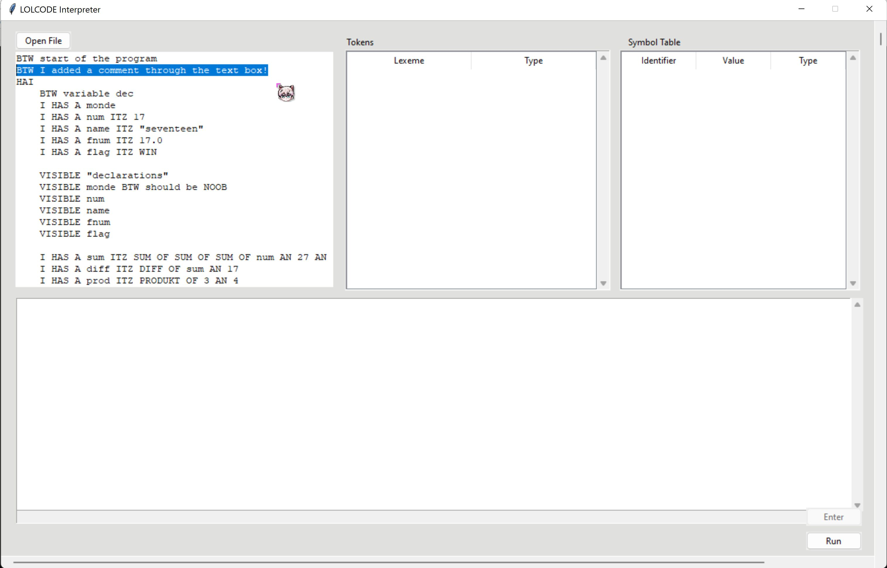

## Tokens and Symbol Table
Once the `Run` button on the lower right is clicked, the tokens and the symbol table of the code will be shown. The tokens indicate the lexemes in the code and its type, and the symbol table shows the list of variables, their values, and their types.

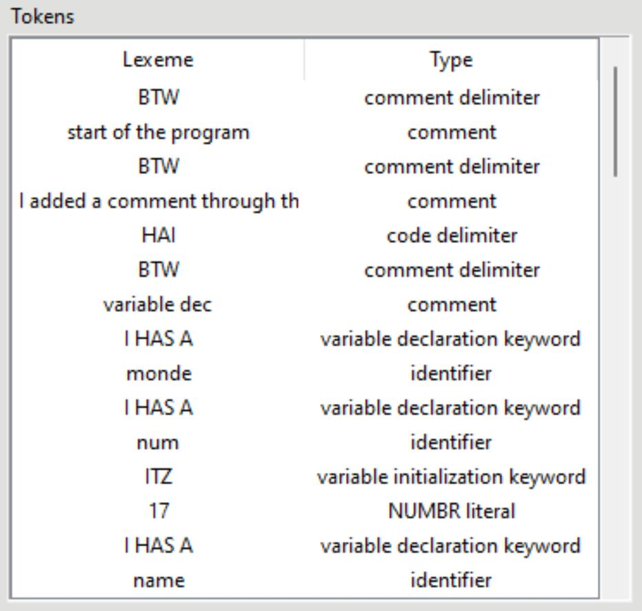
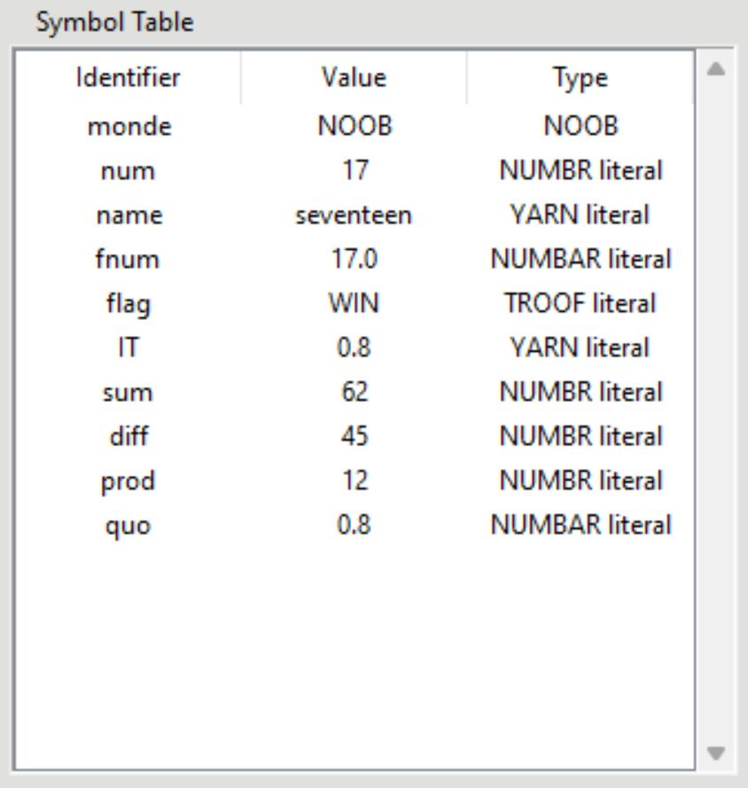

## Console
Just like any normal interpreter, the console at the bottom will print the output of the code once the `Run` button is clicked. Any syntax or semantic errors will be shown through a pop up box.

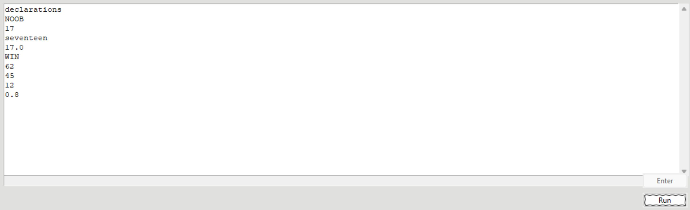
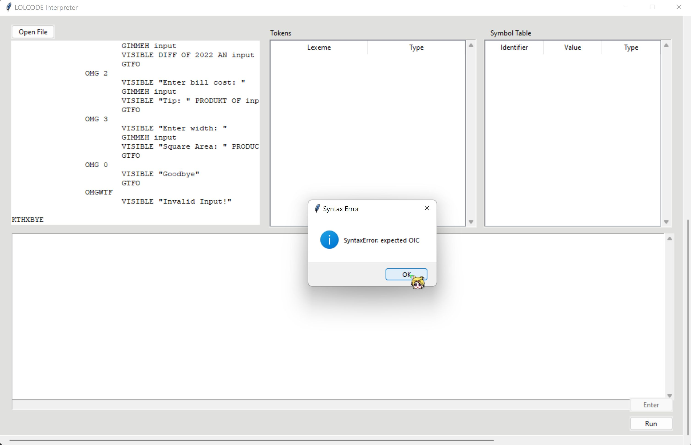

## Input
Whenever you ask for user input, the input box below the console will be available to be typed in and you can press the `Enter` button to enter your input one at a time. Once there are no more inputs to be read, you will not be able to type in the input box or click on the `Enter` button.

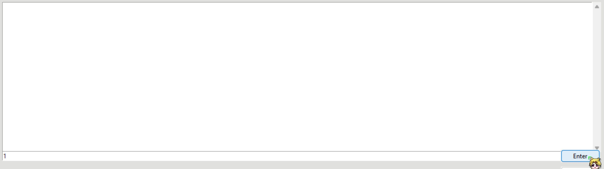

# References
- https://stackoverflow.com/questions/5286093/display-listbox-with-columns-using-tkinter
- https://www.tutorialspoint.com/how-to-display-a-listbox-with-columns-using-tkinter
- https://www.geeksforgeeks.org/python-tkinter-treeview-scrollbar/
- https://www.tutorialspoint.com/how-to-clear-items-from-a-ttk-treeview-widget
- https://stackoverflow.com/questions/60082377/how-to-wait-for-input-in-entry-widget-in-tkinter
- https://stackoverflow.com/questions/13832720/how-to-attach-a-scrollbar-to-a-text-widget
- https://stackoverflow.com/questions/35577359/creating-a-new-line-on-a-textbox-in-tkinter
- https://stackoverflow.com/questions/53937400/how-to-get-the-text-out-of-a-scrolledtext-widget
- https://stackoverflow.com/questions/17746817/how-to-read-the-inputline-by-line-from-a-multiline-tkinter-textbox-in-python
- https://stackoverflow.com/questions/41639671/pop-up-message-box-in-pygame
- https://stackoverflow.com/questions/18458734/how-do-i-plot-list-of-tuples-in-python
- https://www.w3schools.com/python/matplotlib_scatter.asp
- https://www.geeksforgeeks.org/scrollable-frames-in-tkinter/#:~:text=A%20scrollbar%20is%20a%20widget,left%20to%20right%20using%20scrollbars.
- https://stackoverflow.com/questions/3842155/is-there-a-way-to-make-the-tkinter-text-widget-read-only
- https://www.pythontutorial.net/tkinter/tkinter-theme/
- https://stackoverflow.com/questions/24367710/how-do-i-change-the-overall-theme-of-a-tkinter-application
- https://www.pythontutorial.net/tkinter/tkinter-button/
- https://www.pythontutorial.net/tkinter/tkinter-menubutton/
- https://www.geeksforgeeks.org/dropdown-menus-tkinter/
- https://anzeljg.github.io/rin2/book2/2405/docs/tkinter/control-variables.html
- https://anzeljg.github.io/rin2/book2/2405/docs/tkinter/ttk-Label.html
- https://stackoverflow.com/questions/16046743/how-to-change-tkinter-button-state-from-disabled-to-normal
- https://matplotlib.org/stable/users/explain/interactive.html