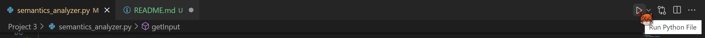
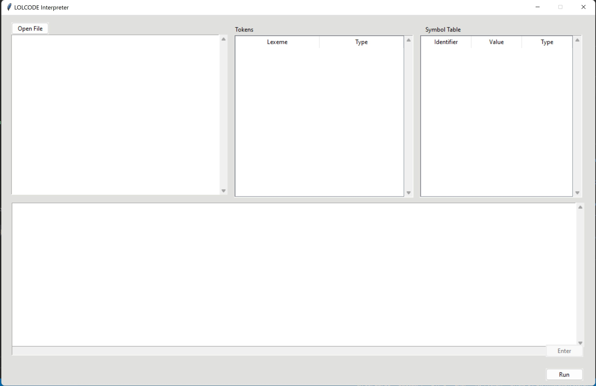

# CMSC 124 Project
**B-4L** - Group EZR 
Rio John Jr. Ducusin 
Zyril Tamargo 
Johanna Eikou Teknomo

# App Guide

In order to start the program, run the semantics_analyzer.py file. You will then see the following GUI pop up.

# References
- https://stackoverflow.com/questions/5286093/display-listbox-with-columns-using-tkinter
- https://www.tutorialspoint.com/how-to-display-a-listbox-with-columns-using-tkinter
- https://www.geeksforgeeks.org/python-tkinter-treeview-scrollbar/
- https://www.tutorialspoint.com/how-to-clear-items-from-a-ttk-treeview-widget
- https://stackoverflow.com/questions/60082377/how-to-wait-for-input-in-entry-widget-in-tkinter
- https://stackoverflow.com/questions/13832720/how-to-attach-a-scrollbar-to-a-text-widget
- https://stackoverflow.com/questions/35577359/creating-a-new-line-on-a-textbox-in-tkinter
- https://stackoverflow.com/questions/53937400/how-to-get-the-text-out-of-a-scrolledtext-widget
- https://stackoverflow.com/questions/17746817/how-to-read-the-inputline-by-line-from-a-multiline-tkinter-textbox-in-python
